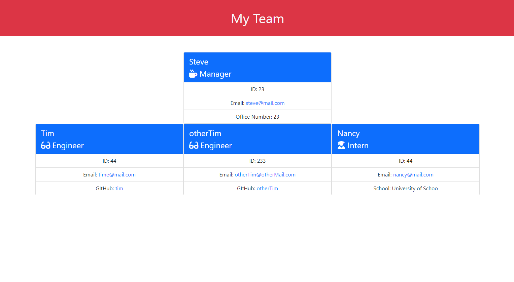

# Team_Profile_Generator

Link to video: https://drive.google.com/file/d/1JStzRsorI6obnPlCIWfhO90Xjpmd_PWe/view

## **Description**

- Team profile generator is an easy to use node application that organizes your immediate team's information. 
- This application was written using JavaScript, HTML, CSS, ES6, bootstrap, Node
- TPG makes it easy to maintain all of your teammates roles and contact information. 
- This project helped to expand my personal understanding of OOP and TDD

## **Table of Contents** 

- [installation](#installation)
- [Usage](#usage)
- [Credits](#credits)
- [License](#license)

## **Installation**

Please follow the link to my Gihub repository and clone the codebase into your local machine. Open with your code editor and install dependencies with `npm i`. Then run `node index` to begin the program

## **Usage**

Follow the prompts to generate your teams' profile

## **Credits** 

This project was built by Michael Cortez 

## **License**

To see more info regarding this license, please visit https://choosealicense.com/licenses/mit/

## **How to Contribute**

If you would like to add/contribute to the project, feel free to fork from GitHub @MCORTEZM1 
Or click here: https://github.com/MCORTEZM1/Team_Profile_Generator

## **Questions / Contact Me**

Please reach out with any questions or concerns directly to: MCORTEZM@yahoo.com

